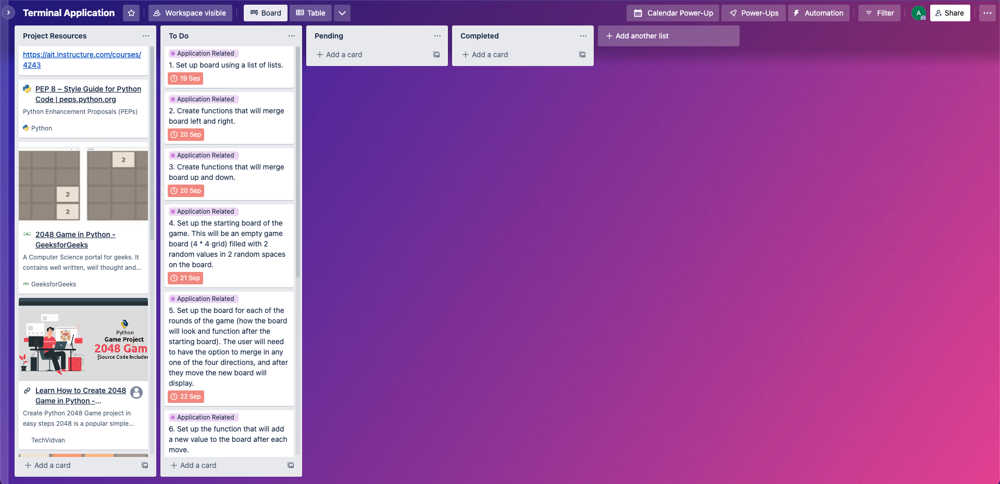
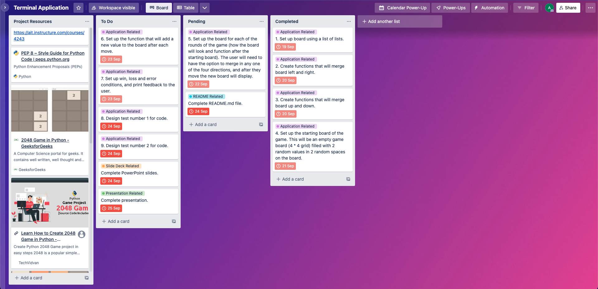
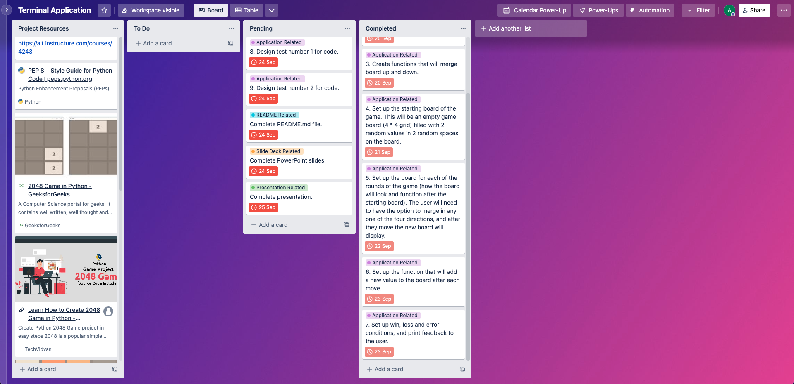

# AdamDobson_T1A3 - Terminal Application

## [GitHub Repository](https://github.com/dobbbo/AdamDobson_T1A3)

## **Style Guide**

Throughout the development of this program, I adhered to the styling conventions listed in the **PEP 8** style guide while writing my Python code. Referenced below is the PEP 8 style guide:

- Van Rossum G, Warsaw B, Coghlan N. *PEP 8 – Style Guide for Python Code.* Python Enhancement Proposals. Available at: https://peps.python.org/pep-0008/. Published 2001.

## **Features:**
### 1. Fully Interactive User Experience and Controls
As the outcome of this game is almost completely reliant on the input of the user, it allows the user to have true control over the direction of each move and ultimately the outcome of the game (win or loss). This high level of interactivity and control gives the user a deeper level of immersiveness throughout each and every game. Along with this, the controls of this game are easy to understand as there is only 4 options of movement available to the user - these being 'w' (up), 'a' (left), 's' (down) and 'd' (right). Upon starting the application, the user is prompted to read through some instructions to gain a better understanding of how 2048 works if they are unfamiliar with the game. The aim of this is to lessen the learning curve of the game for the user. If the user enters an invalid input, they will be prompted with message that asks for a valid input. Upon achieving 2048, the user is given a congratulatory message to make them feel victorious after beating the game. On the contrary, if the user runs out of spaces on the board for new numbers to spawn, the user is given a message of defeat.  Overall, these interactive features and controls work together to enhance the user experience.

### 2. Visual Depiction of Game Board
Perhaps the most prominent feature of this application is the visual depiction of the game board/grid throughout the entirety of the game. This allows the user to actually see the current state of the game, and make their next move accordingly. Between each move the game board will dynamically update and display, giving the user visual feedback to their choice of move as well as the position of the newly added number between each move. The visual game board was developed using a list of lists (4 lists in the board used to represent the rows, and 4 numbers in each row. Ultimately, these rows stack atop each other to form a 4 * 4 grid of number). Through the use of loops, the program will scan through every number on the board and locate the number with the largest length in characters. This is required to ensure uniformity in the widths of all columns in the board, hence making the board far more readable for the user. This function allows for the column widths to automatically and dynamically update throughout the game.

### 3. Random Placement and Generation of Numbers
Through the utilisation of the random module, between each move this application will randomly generate a number (either 2 or 4) as well as a random placement of this number in a random empty space on the 4 * 4 grid. This element of randomness adds a degree of luck, excitement and improvisation to the game. As the amount of empty spaces increases and decreases throughout the game, it was important to create a function that automatically scans through all the possible empty spaces on the board in between each move, and only places the new number in one of those empty spaces. It was also important to ensure that two numbers are randomly added to the board at the very start of the game, before the first move. This is to allow the user to actually get the game started and merge these two numbers together. However, after the first move we must only add one new number in between each move. This meant that we needed to create a function that could take these two scenarios into account, and add the respective amount of new numbers to the board.

## **Implementation Plan**

### **Day 1 - 19th September 2022:**
### *1. Set up initial empty board:*
- We will create the board by using a list of lists.
- The board will start off as an empty list.
- We will need to then create 4 rows (lists) that will go into the board.
- We will then need to add 4 empty spaces (0's) to each row.
- We can then append these rows into the empty board.

### *2. Create a display function that will actually visually display the board in our terminal:*
- Display a 4 * 4 grid.
- Each cell in this grid is separated by '|' on each side. (e.g. |2048|  16| 128|   2|).
- Any spaces occupied by 0 will display as empty cells. This is just my personal preference as I believe it is more readable.
- All cell widths need to be uniform in width so the grid lines up perfectly.
- Can create a function that will scan for the number with the largest width, then apply this width to all other cells in the board.

### **Day 2 - 20th September 2022:**
### *1. Create functions that will merge board left and right:*
- We'll start by creating a function that will merge one single row left. To do this, we'll need to do the following procedure:
    - Move all numbers in the row as far to the left as possible.
    - Check if there are any neighbouring cells with an identical value as the current cell.
    - If there is, double the value of the furthest left cell, and make the current cell = 0 (i.e. merging the two cells together into one cell).
    - Move all numbers in the row as far to the left as possible again.
- Now that we can merge one row left, we can use this function on all the rows in the board, hence merging the entire board left.
- For the merge-right functions, duplicate the merge-left functions, but make slight changes so it functions in the opposite direction.

### **Day 3 - 21st September 2022:**
### *1. Create functions that will merge the board up and down:*
- Encountered particular difficulty with this concept.
- To merge up, we need to follow this procedure:
    - 'Transpose' the current board (essentially flip the board diagonally).
    - Merge-left while transposed.
    - Transpose the board back.
    - The final result will appear and function as if the board has been merged upwards.
- To merge down, we do the exact same procedure, only we merge-right while the board is in it's transposed state.

### **Day 4 - 22nd September 2022:**
### *1. Set up starting board of game that contains two numbers, randomly placed on the board:*
- Use random module to generate either a 2 or a 4.
- Use random module to generate random 'co-ordinates' where each value will be placed:
    - Store on of these numbers in a row-number variable.
    - Store the other in a column-number variable.
- Add these values to the board.

### *2. Set up board for each following round of the game:*
- Now that the board has been initialised with 2 new values, we only need to add 1 new value in between each move hereafter.
- Update the function to only provide 1 new value after the initial board has been set up.
- Still use random module to generate either a 2 or 4.
- Continue using random module to generate random row and column number for placement.
- We will need to make this function only add new values to empty spaces (cells containing 0).

### **Day 5 - 23rd September 2022:**
### *1. Set up controls/reponse to user input:*
- Greet user.
- Display initial board.
- Ask user for which direction they wish to merge:
    - 'w' = up
    - 'a' = left
    - 's' = down
    - 'd' = right

### *2. Make the game respond to whether the user wins, loses or if the user causes an error:*
- If user achieves 2048:
    - Congratulate user.
    - End game.
- If the user runs out of spaces to move:
    - Send loss message to user.
    - End game.
- If user enters invalid input (anything other than w, a, s, d):
    - Inform user via a message.
    - Ask for new input.

### **Day 6 - 24th September 2022:**
### *1. Design tests for code.*
### *2. Make any final edits/changes to code. Clean up code and ensure everything is dry and functional.*
### *3. Work on/finish up on README, slide deck and presentation.*

### **Day 7 - 25th September 2022:**
### *1. Work on/finish up on README, slide deck and presentation.*
### *2. Submit assignment!*

## **Development Tracking - Trello Board**

### Screenshot of Trello board at the very start of development:

### Screenshot of Trello board mid-way through development:

### Screenshot of Trello board towards the end of development:

## **Instructions**

## **References**